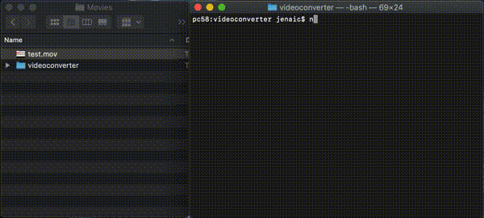

# Video converter

Converts .mov to .mp4 then to .gif and can upload to Slack all at once



## Installation

### Requirements

- Node.js 10+

### Steps

```
npm i
vim .env
```

#### .env variables

- SLACK_BOT_TOKEN
- SLACK_CHANNEL

## Usage

```
node cli.js -i <.mov path>
    [-mp4-start-at=<in sec>] [-mp4-end-at=<in sec>]
    [-gif-width=<in px>] [-gif-height=<in px>] [-gif-is-width-ratio=true|false]
    [-is-slack-upload=true|false]
```

| Name                | Default |  Description                                                        |
| ------------------- | ------- | ------------------------------------------------------------------- |
| -i                  | null    | Relative path to the .mov file                                      |
| -mp4-start-at       |  null   | Will omit the first n seconds of the video                          |
| -mp4-end-at         |  null   | Length in seconds of the mp4. Start from `-mp4-start-at` if defined |
| -gif-width          |  600    | Width in pixel of the gif                                           |
| -gif-height         | null    | Height in pixel of the gif                                          |
| -gif-is-width-ratio | true    | Put `false` if the video is in portrait mode                        |

## TODO

- [ ] Use a prompt-like module to answer several questions before the conversion (so it removes the hassle of knowing all the options)
